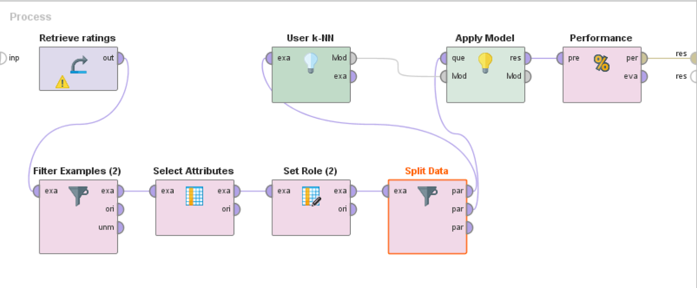

# Books2Rec: Machine Learning meets Reading
Books2Rec is a book recommender system built for the Big Data Science class at NYU. Using your [Goodreads](https://www.goodreads.com/) profile, Books2Rec uses Machine Learning methods to provide you with highly personalized book recommendations. Don't have a Goodreads profile? We've got you covered - just search for your favorite book.

[Check it out](https://books2rec.me/).

## Table of Contents
- [Introduction](#introduction)
- [How it Works](#how-it-works)
- [Project Structure](#project-structure)
  - [Data Sources](#data-sources)
  - [RapidMiner](#rapidminer)
  - [Mahout](#mahout)
  - [Surprise](#surprise)
  - [Recommendation Pipeline](#recommendation-pipeline)
  - [Web App](#web-app)
- [Contributing](#contributing)
- [Authors](#authors)
- [Acknowledgements](#acknowledgements)

## Introduction
TODO

## How it Works
TODO

## Project Structure
As heavily encouraged by our advisor, Dr. Anasse Bari, we have tried a lot of different technologies in our quest to make a book recommender system. As such, we have multiple different mini-projects in this repo. These are mostly contained into individual folders.

### Data Sources
#### Goodbooks 10k
Download the Goodreads data from [goodbooks-10k repository](https://github.com/zygmuntz/goodbooks-10k), extract it, and place it under the `data` folder (so that the `ratings.csv` file would be at `data/goodbooks-10k/ratings.csv`). You might also want to extract the `books_xml.zip` to see and use the full xml documents.

#### Amazon Ratings
The Amazon ratings were kindly provided by [Jure Leskovec](https://snap.stanford.edu/data/web-Amazon.html) and [Julian McAuley](http://jmcauley.ucsd.edu/data/amazon/). We used the subset of the book ratings that matched the Goodbooks 10k dataset.

#### Data Preprocessing
TODO

### 
[RapidMiner](https://rapidminer.com/) is a Data Science platform that allows for rapid prototyping of Data Science algorithms. We used RapidMiner to get a 'feel' for our data. It was great for quickly applying models and seeing their results, but it proved inflexible, and it could not handle more than 12000 users until there was a memory error or an array overflow. The RapidMiner `rmp` files that were used to generate the recommendations can be found in the [RapidMiner](RapidMiner/) folder. They were able to achieve a RMSE of 0.864 and a MAE of 0.685.

### 
TODO

### Surprise
TODO

### Recommendation Pipeline
TODO

### Web App
TODO
## Contributing
Please read [CONTRIBUTING.md](CONTRIBUTING.md) for details on our code of conduct, and the process for submitting pull requests to us.

## Authors
- **[Nick Greenquist](https://nickgreenquist.github.io/)**
- **[Doruk Kilitcioglu](https://dorukkilitcioglu.github.io/)**
- **[Amit Panghal](https://panghalamit.github.io/)**

## Acknowledgements
- **[Dr. Anasse Bari](https://cs.nyu.edu/~abari/)** - _Project Advisor_
