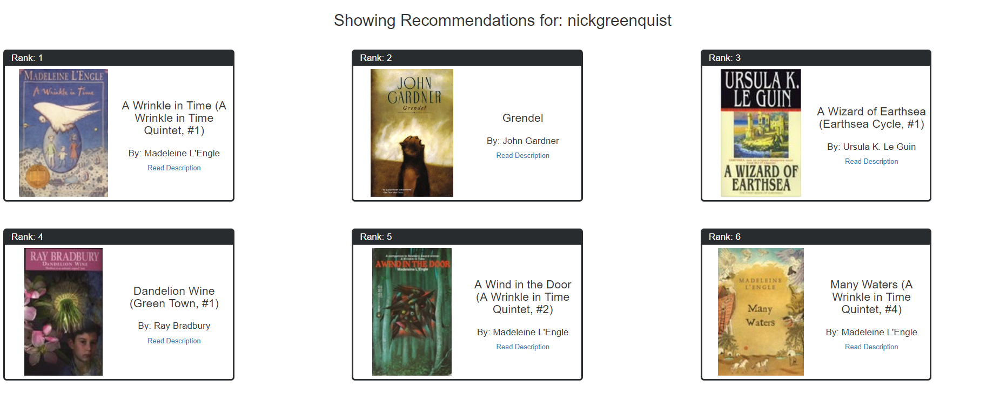
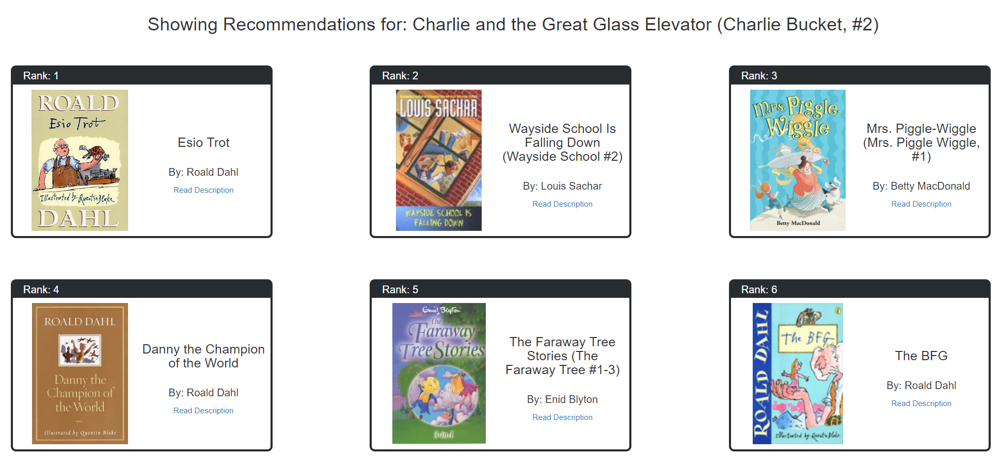
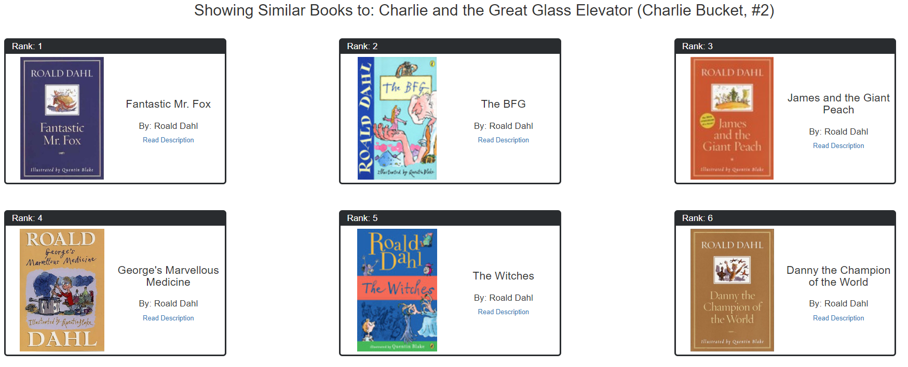
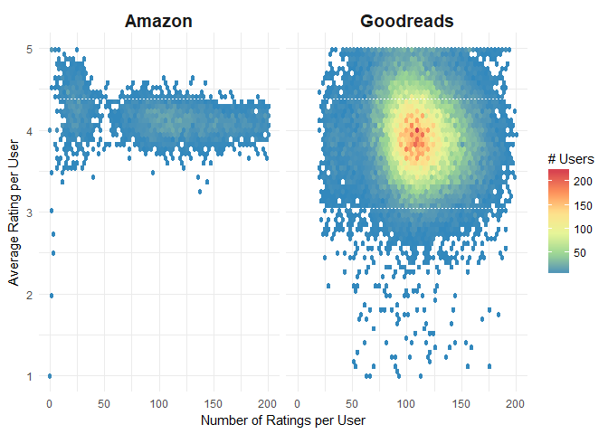
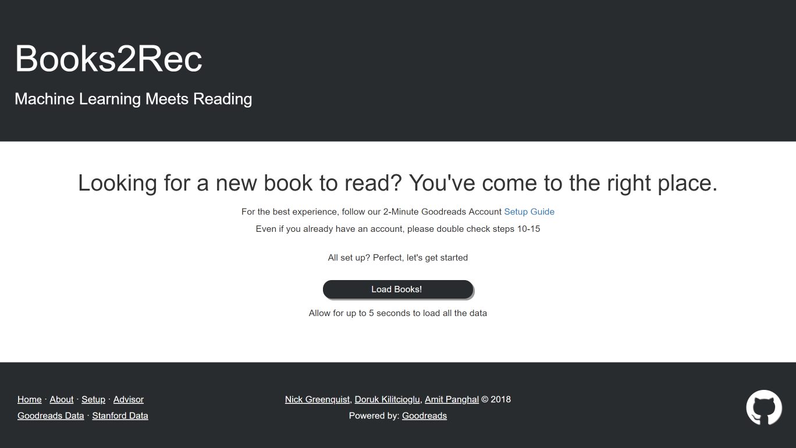

# Books2Rec: Machine Learning meets Reading

[Books2Rec](https://books2rec.me/) is a book recommender system built for the Big Data Science class at NYU. Using your [Goodreads](https://www.goodreads.com/) profile, Books2Rec uses Machine Learning methods to provide you with highly personalized book recommendations. Don't have a Goodreads profile? We've got you covered - just search for your favorite book.

### [Check it out here!](https://books2rec.me/)

## Table of Contents
- [Introduction](#introduction)
- [How it Works](#how-it-works)
- [Project Structure](#project-structure)
  - [Data Sources](#data-sources)
  - [RapidMiner](#rapidminer)
  - [Mahout](#mahout)
  - [Surprise](#surprise)
  - [Recommendation Pipeline](#recommendation-pipeline)
  - [Web App](#web-app)
  - [Tools Used](#tools-used)
- [Contributing](#contributing)
- [Authors](#authors)
- [Acknowledgements](#acknowledgements)
- [References](#references)

## Introduction
Recommender systems is at the forefront of the ways in which content-serving websites like Facebook, Amazon, Spotify, etc. interact with its users. It is said that 35% of Amazon.com’s revenue is generated by its recommendation engine[1]. Given this climate, it is paramount that websites aim to serve the best personalized content possible.

As a trio of book lovers, we looked at Goodreads, the world's largest site for readers and book recommendations. It is owned by Amazon, which itself has a stellar recommendation engine. However, we found that their recommendations leave a lot to be desired.

<figure>
    
    <figcaption><i>Example of an unrelated recommendation by Goodreads.</i></figcaption>
</figure>

  
We are using a hybrid recommender system in order to provide recommendations for Goodreads users (ratings and item features).

    <figure>
        
        <figcaption><i>Example of our recommendations based on our hybrid model. </i></figcaption>
    </figure>

  
We also provide more 'traditional' recommendations that only use the book's features. 

    <figure>
        
        <figcaption><i>Example of our recommendations based on pure book metadata features. Notice how it picks up on all the other books from the author despite <code>author</code> not being a feature we included in our model.</i></figcaption>
    </figure>

## How it Works
We use a hybrid recommender system to power our recommendations. Hybrid systems are the combination of two other types of recommender systems: content-based filtering and collaborative filtering. Content-based filtering is a method of recommending items by the similarity of the said items. That is, if I like the first book of the Lord of the Rings, and if the second book is similar to the first, it can recommend me the second book. Collaborative filtering is a method by which user ratings are used in order to determine user or item similarities. If there is a high correlation of users rating the first Lord of the Rings book and the second Lord of the Rings book, then they are deemed to be similar.

Our hybrid system uses both of these approaches. Our item similarities are a combination of user ratings and features derived from books themselves.

Powering our recommendations is the Netflix-prize winner SVD algorithm[2]. It is, without doubt, one of the most monumental algorithms in the history of recommender systems. Over time, we are aiming to improve our recommendations using the latest trends in recommender systems.

### SVD for Ratings Matrix
What makes the SVD algorithm made famous during the Netflix challenge different than standard SVD is that it does **NOT** assume missing values are 0[3]. Standard SVD is a perfect reconstruction of a matrix but has one flaw for our purposes: if a user has not rated a book (which is going to most books), then SVD would model them as having a 0 rating for all missing books. 

In order to use SVD for rating predictions, you have to update the values in the matrix to negate this effect. You can use Gradient Descent on the error function of predicted ratings to accomplish this. Once you run Gradient Descent enough times, every value in the decomposed matrix begins to better reflect the correct values for predicting missing ratings, and not for reconstructing the matrix. 

### Evaluation Metrics
As with all Machine Learning based projects, you want to make sure what you have used is 'better' than other popular methods. As stated before, we used RMSE to evaluate the performance of our trained Latent Factor (SVD) model. Below are the RMSE for several algorithms we calculated while building this project.

There are two widely used metrics in recommender systems that we also use. The **Mean Averaged Error**, otherwise known as _MAE_, is the average difference between a predicted rating an the actual rating. Its close cousin, **Root Mean Squared Error** (otherwise known as _RMSE_) is still an average distance, but the difference between the predicted rating and the actual rating is squared, meaning that it is much more costly to miss something by a large margin than to miss something by a small margin.

| Approach | Params | Data | RMSE |
| -------- | -------- | -------- | -------- |
| Baseline (Item and User mean ratings with bias) | NA    | Full (Goodreads + Amazon)  | 0.865  |
| Random        | NA    | Full (Goodreads + Amazon)  | 1.33  |
| User k-NN  | NA                       | Full (Goodreads + Amazon)  | 0.8875662310051954 |
| Item k-NN  | NA                       | Full (Goodreads + Amazon)  | 0.8876182681047732 |
| Slope One        | NA    | Full (Goodreads + Amazon)  | 0.856  |
| NMF        | NA    | Full (Goodreads + Amazon)  | 0.877  |
| Co-Clustering        | NA    | Full (Goodreads + Amazon)  | 0.873  |
| **SVD**      | factors=300, epochs=100  | Full (Goodreads + Amazon)  | **0.842684489142339**  |
| SVD        | factors=10, epochs=50    | Full (Goodreads + Amazon)  | 0.844118472532902  |
| SVD        | factors=1000, epochs=20  | Full (Goodreads + Amazon)  | 0.8627727919676756 |
| Autoencoder | X-300-200-300-X | Full (Goodreads + Amazon) | 0.893 |

**Note**: Not all results from HPC grid search are shown here, only the top model from each batch (small params, large params, medium params).  
**Note**: The Autoencoder (inspired by this paper[4]) results are highly experimental and need further hyperparameter optimization.

Our final model uses the SVD with 300 factors trained with 100 epochs. Overall, the lower factor models consistently had the best performance versus the very high factor models, however this middle ground (300 factors, 100 epochs) was the absolute best result from our grid search. We also subjectively liked the recommendations it gave for test users more than the very small factor model. This is because with only 10 factors, the model is very generalized. While this might provide small error for rating predictions, the recommendations it gave seemed to make no sense. 

### Why Hybrid?
Why would we not just use one, hyper-optimized Latent Factor (SVD) Model instead of combining it with a Content Based model?

The answer is simply a pure SVD model can lead to very nonsensical, 'black box' recommendations that can turn away users. A trained SVD model is simply trying to assign factor strenghts in a matrix for each item in order to minimize some cost function. This cost function is simply trying to minimize the error of predicting hidden ratings in a test set. What this leads to is a very optimized model that, when finally used to make recommendations for new users, can spit out very **subjectively** strange recommendations. 

For example, say there is some book A that after being run through a trained SVD model, is most similar in terms of ratings as a book B. The issue is that book B can be completely unrelated to A by 'traditional' standards (what the book is about, the genre, etc). What this can lead to is a book like Lord of the Rings Return of the King ending up being most 'similar' to a completely unrelated book like Sisterhood of Traveling Pants (yes this happened). This is because it could just be the case that these two books happen to always be rated similarly by users and thus, the SVD model learns to always recommend these books together because it will minimize it's error function. However, if you ask most fantasy readers, they would probably prefer to be recommended more fantasy books (but not just all other books by Tolkien).

What this leads to is trying to find a balance between exploration (using SVD to recommend books that are similar only in how they are rated by tens of thousands of users) and understandable recommendations (using Content features to recommend other fantasy books if the user has enjoyed the Lord of the Rings books). To solve this issues, we combine the trained SVD matrix with the feature matrix. By doing this, when we map a user to this matrix, the user is mapped to all the hidden concept spaces SVD has learned. Then all the books that model returns are then weighted by how similar they are to the features of the books that the user has highly rated. By doing this, you will get recommendations that are not purely within the same genre that you enjoy, but also not completely oblivious to the types of books you like. 

## Project Structure
As heavily encouraged by our advisor, Dr. Anasse Bari, we have tried a lot of different technologies in our quest to make a book recommender system. As such, we have multiple different mini-projects in this repo. These are mostly contained into individual folders.

### Data Sources
#### Goodbooks 10k
Download the Goodreads data from [goodbooks-10k repository](https://github.com/zygmuntz/goodbooks-10k), extract it, and place it under the `data` folder (so that the `ratings.csv` file would be at `data/goodbooks-10k/ratings.csv`). You might also want to extract the `books_xml.zip` to see and use the full xml documents.

#### Amazon Ratings
The Amazon ratings were kindly provided by [Jure Leskovec](https://snap.stanford.edu/data/web-Amazon.html) and [Julian McAuley](http://jmcauley.ucsd.edu/data/amazon/)[5][6]. We used the subset of the book ratings that matched the Goodbooks 10k dataset.

#### Data Preprocessing
Data preprocessing is one of the (if not _the_) most significant part of any Data Science project. The most difficult part of our data preprocessing was joining the Goodreads data and the Amazon ratings together. The Amazon ratings were attached an Amazon Standard Identification Number (ASIN), but not an ISBN. We mapped the ASIN to book titles, the Goodreads book ids to book titles, and did a hash-join on the two title sets to join both sets of ratings together. This step can be found under the [Preprocessing](Preprocessing/) folder.

In order to see the difference between the rating distribution between the two datasets, we used visualizations. The visualizations were generated using `R` programming language, and can be found under the [Visualization](Visualization/) folder.

The next step was generating the book features, which was done by constructing tf-idf vectors of the book descriptions, tags, and shelves. There were also a lot of missing images in the Goodreads dataset, which decreased the quality of our web app by a lot, and so these images were re-obtained from Goodreads. These steps can be found under the [Transformation](Transformation/) folder.

After these steps, the data was clean enough to be server on the web server and converted into a numerical format that was able to be consumed by Machine Learning algorithms.

### 
[RapidMiner](https://rapidminer.com/) is a Data Science platform that allows for rapid prototyping of Machine Learning algorithms. We used RapidMiner to get a 'feel' for our data. It was great for quickly applying models and seeing their results, but it proved inflexible, and it could not handle more than 12000 users until there was a memory error or an array overflow. The RapidMiner `rmp` files that were used to generate the recommendations can be found in the [RapidMiner](RapidMiner/) folder. They were able to achieve a RMSE of 0.864 and a MAE of 0.685.

### 
[Apache Mahout](https://mahout.apache.org/) is a distributed linear algebra framework that has a lot of built-in Machine Learning algorithms. Crucially for us, it implements a lot of the most common algorithms for recommender systems out of the box. We used Mahout's `ItemBasedRecommender` in order to generate item recommendations. We were able to achive a RMSE of 0.888. The Eclipse project that was used to generate recommendations can be found in the [Mahout/RecommenderSystem](Mahout/RecommenderSystem) folder.

### Surprise
[Surprise](http://surpriselib.com/) is a Python library designed to generate recommendations and evaluate recommenders. It provides a nice API and a nice pipeline for recommender systems, but we found that it was not as malleable as we wanted it to be. It proved to be quite difficult getting different sorts of recommenders to work nicely with it's pipeline, but standard algorithms like SVD was a breeze.

We used the Surprise library in order to do matrix factorization on the user-item matrix. The SVD algorithm of Surprise uses Gradient Descent to optimize the RMSE, which is one of our end goals. This differs from the regular SVD, where the regular one tries to minimize the matrix reconstruction error. The crucial difference is that **Surprise does not assume that unrated items are rated as 0.**

There are multiple hyperparameters one can use for training the SVD model. We used Grid Search on the hyperparameter space in order to find the best hyperparameters, with the help of [NYU High Performance Computing](https://wikis.nyu.edu/display/NYUHPC/High+Performance+Computing+at+NYU). The code for that can be found in the [HPC](HPC/) folder.

### Recommendation Pipeline
In order to have better control over the recommendations, we built our own recommendation pipeline. This pipeline takes as input the preprocessed ratings and book features, uses SVD to learn the item-concept matrix for both ratings and book features, combines the two results, calculates book similarities, and produces recommendations. For testing, this pipeline also includes k-fold cross validation and the calculation of error metrics. The code can be found in the [Util](Util/) folder, divided into multiple logical pieces.

A version of the pipeline that uses Deep Learning to generate recommendations can be found in the [Evaluation](Evaluation/) folder, and will be completed in the future.

### Web App
Our web application is powered by [Flask](http://flask.pocoo.org/), the easy to use Python web framework. As mentioned above, our website is [live](https://books2rec.me/) for you to test your recommendations with. The code that powers it can be found under the [WebApp](WebApp/) folder.

### Tools Used
- **Surprise**: See [Surprise](#surprise)
- **Rapidminer**: See See [RapidMiner](#rapidminer)
- **RStudio**: We used RStudio for Data Understanding visualizations
- **Jupyter Notebook**: For testing all aspects of the Project Lifecycle. Code was moved to a general Util API folder once deemed useful
- **Python**: The language of choice for the project and the web app
- **Pandas**: Used to store books with all their metadata and also to store the user-item ratings
- **Hadoop (on HPC Dumbo)**: Used to get baseline metrics for collaborative filtering. Precomputation of item-item similarity matrix using large item-feature matrix on spark. This is used as input to content-based recommendation model in Mahout.
- **HPC (NYU Prince)**: There are multiple hyperparameters one can use for training the SVD model. We used Grid Search on the hyperparameter space in order to find the best hyperparameters, with the help of NYU High Performance Computing. The code for that can be found in the HPC folder.
- **Mahout**: See [Mahout](#mahout)
- **Eclipse**: We used Eclipse to build and run the Mahout project as Java Desktop application.
- **Scikit-learn**: We used Scikit-learn to run our vanilla SVD on item features.
- **Scipy**: Used for efficiently storing sparse matrices (ratings matrices are extremely sparse)
- **Tensorflow**: We used Tensorflow to test our Autoencoder, which was used to generate representations of items similar to how SVD on the item features work. Unfortunately, there are a lot of different hyperparameters to optimize with Deep Neural Networks, and we made better use of our time by focusing on the web app than the Autoencoder.
- **Flask**: See [Web App](#web-app)
- **Digital Ocean**: Our web application is hosted on a DO server. We selected 1gb of memory as to be a lightweight deployment

## Contributing
Please read [CONTRIBUTING.md](CONTRIBUTING.md) for details on our code of conduct, and the process for submitting pull requests to us.

## Authors
- **[Nick Greenquist](https://nickgreenquist.github.io/)**
- **[Doruk Kilitcioglu](https://dorukkilitcioglu.github.io/)**
- **[Amit Panghal](https://panghalamit.github.io/)**

## Acknowledgements
- **[Dr. Anasse Bari](https://cs.nyu.edu/~abari/)** - _Project Advisor_

## References
1. http://www.mckinsey.com/industries/retail/our-insights/how-retailers-can-keep-up-with-consumers
2. [The BellKor Solution to the Netflix Grand Prize](https://www.netflixprize.com/assets/GrandPrize2009_BPC_BellKor.pdf)
3. [Generalized Hebbian Algorithm for Incremental Latent Semantic Analysis](http://citeseerx.ist.psu.edu/viewdoc/download?doi=10.1.1.125.8971&rep=rep1&type=pdf)
4. [Hybrid Recommender System based on Autoencoders](https://arxiv.org/pdf/1606.07659.pdf)
5. [R. He, J. McAuley. Modeling the visual evolution of fashion trends with one-class collaborative filtering. WWW, 2016](https://arxiv.org/abs/1602.01585)
6. [J. McAuley, C. Targett, J. Shi, A. van den Hengel. Image-based recommendations on styles and substitutes. SIGIR, 2015](https://arxiv.org/abs/1506.04757)
