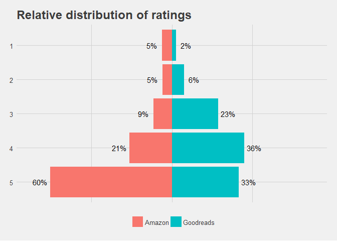
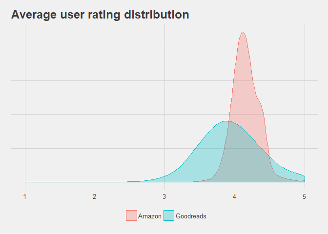

## Amazon vs Goodreads Ratings

We try to visualize the ratings from our two sources of data. Both of the csv files are in the standard user-item-rating format.


```r
library(tidyverse)
```

```
## -- Attaching packages -------------------------------------------------------------------------------- tidyverse 1.2.1 --
```

```
## v ggplot2 2.2.1     v purrr   0.2.4
## v tibble  1.4.2     v dplyr   0.7.4
## v tidyr   0.8.0     v stringr 1.3.0
## v readr   1.1.1     v forcats 0.3.0
```

```
## -- Conflicts ----------------------------------------------------------------------------------- tidyverse_conflicts() --
## x dplyr::filter() masks stats::filter()
## x dplyr::lag()    masks stats::lag()
```

```r
goodreads <- read_csv("../data/goodbooks-10k/ratings.csv")
```

```
## Parsed with column specification:
## cols(
##   user_id = col_integer(),
##   book_id = col_integer(),
##   rating = col_integer()
## )
```

```r
head(goodreads)
```

```
## # A tibble: 6 x 3
##   user_id book_id rating
##     <int>   <int>  <int>
## 1       1     258      5
## 2       2    4081      4
## 3       2     260      5
## 4       2    9296      5
## 5       2    2318      3
## 6       2      26      4
```


```r
amazon <- read_csv("../data/amazon/ratings_amazon.csv")
```

```
## Parsed with column specification:
## cols(
##   user_id = col_integer(),
##   book_id = col_integer(),
##   rating = col_integer()
## )
```

```
## Warning in rbind(names(probs), probs_f): number of columns of result is not
## a multiple of vector length (arg 1)
```

```
## Warning: 4 parsing failures.
## row # A tibble: 4 x 5 col       row col     expected   actual  file                                expected     <int> <chr>   <chr>      <chr>   <chr>                               actual 1  854024 book_id an integer book_id '../data/amazon/ratings_amazon.csv' file 2 1994797 book_id an integer book_id '../data/amazon/ratings_amazon.csv' row 3 1994798 book_id an integer book_id '../data/amazon/ratings_amazon.csv' col 4 1994799 book_id an integer book_id '../data/amazon/ratings_amazon.csv'
```

```r
head(amazon)
```

```
## # A tibble: 6 x 3
##      user_id book_id rating
##        <int>   <int>  <int>
## 1 1314748800    3565      5
## 2 1363564800    5972      5
## 3 1359331200    4209      5
## 4 1327363200      46      2
## 5 1217203200      46      1
## 6 1359590400      46      5
```

We first look at the difference in the distributions of the data.


```r
library(ggthemes)
all_ratings <- bind_rows(
  goodreads %>%
    mutate(Source = "Goodreads"),
  amazon %>%
    mutate(Source = "Amazon")
)
gsum <- goodreads %>%
  group_by(rating) %>%
  summarize(Count = n()) %>%
  mutate(Source = "Goodreads", Percent = Count/sum(Count)) %>%
  ungroup()
asum <- amazon %>%
  group_by(rating) %>%
  summarize(Count = n()) %>%
  mutate(Source = "Amazon", Percent = Count/sum(Count)) %>%
  ungroup()
csum <- all_ratings %>%
  group_by(rating, Source) %>%
  summarize(Count = n()) %>%
  group_by(Source) %>%
  mutate(Percent = Count/sum(Count))
head(csum)
```

```
## # A tibble: 6 x 4
## # Groups:   Source [2]
##   rating Source      Count Percent
##    <int> <chr>       <int>   <dbl>
## 1      1 Amazon     117687  0.0488
## 2      1 Goodreads  124195  0.0208
## 3      2 Amazon     112990  0.0468
## 4      2 Goodreads  359257  0.0601
## 5      3 Amazon     217131  0.0900
## 6      3 Goodreads 1370916  0.229
```


```r
ggplot(csum, aes(x = reorder(rating, -rating), y = Percent, fill = Source)) +
  geom_bar(data = filter(csum, Source == "Goodreads"), stat = "identity") +
  geom_bar(data = filter(csum, Source == "Amazon") %>% mutate(Percent = -Percent), stat = "identity") +
  geom_text(data = filter(csum, Source == "Goodreads"), aes(label = sprintf("%.0f%%", Percent * 100), x = reorder(rating, -rating), y = Percent + 0.05)) +
  geom_text(data = filter(csum, Source == "Amazon"), aes(label = sprintf("%.0f%%", Percent * 100), x = reorder(rating, -rating), y = -Percent - 0.05)) +
  coord_flip() +
  scale_y_continuous(limits = c(-.7, .7), labels = NULL) +
  ylab("# Ratings") +
  xlab("Rating") +
  theme_fivethirtyeight() +
  theme(legend.title=element_blank()) +
  ggtitle("Relative distribution of ratings")
```

<!-- -->

It is apparent that Amazon ratings are heavily biased towards 5 stars, while the Goodreads ratings are more balanced.


```r
all_ratings %>%
  group_by(user_id, Source) %>%
  summarize(Avg_Rating = mean(rating)) %>%
  group_by(Source) %>%
  summarize(Avg = mean(Avg_Rating))
```

```
## # A tibble: 2 x 2
##   Source      Avg
##   <chr>     <dbl>
## 1 Amazon     4.16
## 2 Goodreads  3.93
```

The average ratings per user are also quite high. Even though the distribution looks very skewed for Amazon, the average ratings per user are not too different.

We also look at the distributions of user ratings.


```r
user_averages <- all_ratings %>%
  group_by(user_id, Source) %>%
  summarize(Avg_Rating = mean(rating), Num_Rated = n(), Variance = var(rating))

ggplot(user_averages, aes(x = Avg_Rating, fill = Source, color = Source)) +
  geom_density(alpha = .3, kernel = "gaussian", adjust = 1.8) +
  xlab("Average Rating per User") +
  ylab("") +
  theme_fivethirtyeight() +
  theme(legend.title=element_blank(),
        axis.text.y=element_blank()) +
  ggtitle("Average user rating distribution")
```

<!-- -->

The Goodreads ratings look like a standard Gaussian curve, while the Amazon ratings look a bit more bimodal (see the little part sticking out to the right) and is much more concentrated (has less variance).

I also wanted to explore the correlation between the number of ratings of a user and the user's average rating.


```r
ggplot(filter(user_averages, Num_Rated <=200), aes(x = Num_Rated, y = Avg_Rating)) +
  geom_hex(bins = 60) +
  scale_fill_distiller(palette = "Spectral") +
  facet_grid(.~Source) +
  ylab("Average Rating per User") +
  xlab("Number of Ratings per User") +
  theme_minimal() +
  theme(strip.text = element_text(size = 14, face = "bold")) +
  labs(fill = "# Users")
```

```
## Warning: package 'hexbin' was built under R version 3.4.4
```

<!-- -->

As you can see, there doesn't seem to be much of a correlation, although we can clearly see how most users are centered around the average rating of 4 and around 100 books.

These results warn us against naively adding in both of the ratings together. At the very least, we need to normalize the ratings across the two datasets, but even that will not help with the fact that the distribution of the ratings are so different. It may even be in our best interests to not add the Amazon ratings, but we can only try and see.
